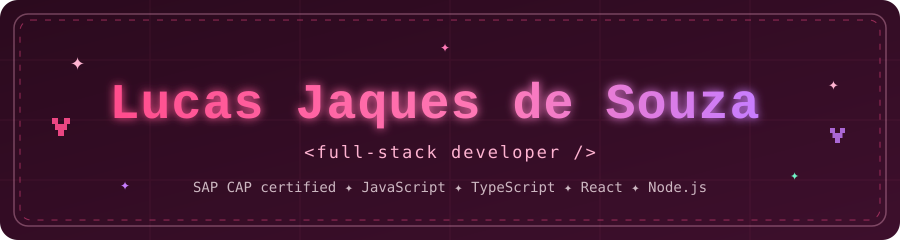
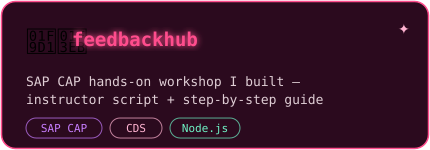
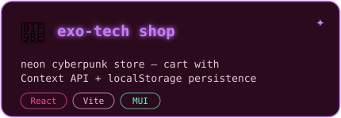
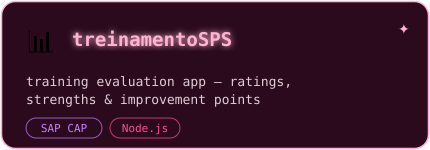
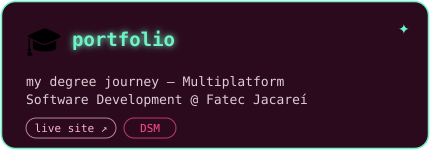

## 🌸 about me

- 🎀 <samp>full-stack developer — <b>JavaScript · TypeScript · React · Node.js</b></samp>
- 🏅 <samp><b>SAP Certified Associate – Backend Developer (CAP)</b></samp>
- 🎓 <samp>graduated in <b>Multiplatform Software Development</b> @ Fatec Jacareí</samp>
- 🧑‍🏫 <samp>I write & run hands-on <b>SAP CAP workshops</b> (FeedbackHub 💖)</samp>
- 🕹️ <samp>built a neon cyberpunk shop just for fun — pink glow is my brand</samp>
- 🌱 <samp>currently exploring the <b>SAP BTP</b> ecosystem</samp>

## 🎀 my toolbox

 

## 💖 things I made

## ✨ my streak

## 🐍 pink snake says hi

<picture>
  <source media="(prefers-color-scheme: dark)" srcset="https://raw.githubusercontent.com/jaqueslucas/jaqueslucas/output/github-snake.svg"/>
  <source media="(prefers-color-scheme: light)" srcset="https://raw.githubusercontent.com/jaqueslucas/jaqueslucas/output/github-snake-light.svg"/>
  
</picture>

## 🤝 let's talk!

  
<samp>made with 💖 and way too much pink</samp>

